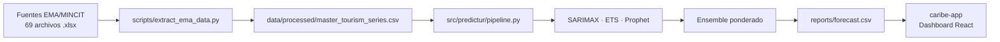

# <p align="center"></p>

# Predictur: Tourism Demand Forecasting

**Sistema de inteligencia de datos para el Caribe colombiano que combina ingeniería de datos y series de tiempo para optimizar la toma de decisiones estratégicas en el sector turístico.**

---

## 📝 Introducción

El turismo es el motor económico del Caribe colombiano, pero muchas decisiones críticas del sector se toman sin suficiente evidencia cuantitativa. **Predictur** construye un sistema end-to-end que automatiza la extracción de datos oficiales, entrena y compara múltiples modelos de pronóstico, y expone los resultados a través de un dashboard narrativo interactivo.

El proyecto integra tres disciplinas:

1. **Ingeniería de datos** — recolección trazable y reproducible desde fuentes oficiales (EMA/MINCIT).
2. **Series de tiempo** — extracción de patrones históricos y generación de pronósticos accionables.
3. **Data storytelling** — transformación de números complejos en recomendaciones estratégicas para tomadores de decisión no técnicos.

---

## 🚀 Características principales

- **Pipeline automatizado** — descarga y procesamiento de los reportes mensuales EMA (Encuesta de Ocupación Hotelera) desde 2020 hasta la fecha.
- **Modelado multi-enfoque** — SARIMAX, ETS (Holt-Winters) y Prophet entrenados y evaluados bajo el mismo protocolo de validación cruzada walk-forward.
- **Ensemble ponderado** — combinación de los tres modelos usando pesos inversos al MAPE de cada uno, reduciendo el error frente a cualquier modelo individual.
- **Regresores exógenos** — flags binarios para el shock COVID (mar 2020 – jun 2021), la recuperación post-COVID, Semana Santa, Carnaval de Barranquilla y temporada alta (dic/ene).
- **Dashboard interactivo** — aplicación React con narrativa scrolly-telling construida sobre los pronósticos generados.
- **Reproducibilidad total** — entorno gestionado con `uv` y Python 3.12; un solo comando ejecuta todo el pipeline.

---

## 📊 Arquitectura del sistema



---

## � Estructura del proyecto

```
predictur/
├── data/
│   ├── raw/                        # 69 reportes EMA mensuales (.xlsx, 2020–2026)
│   └── processed/
│       └── master_tourism_series.csv   # Serie maestra procesada
│
├── src/predictur/                  # Paquete Python principal
│   ├── data.py                     # Carga de la serie (load_series, load_full_frame)
│   ├── features.py                 # Regresores exógenos (COVID, Semana Santa, Carnaval)
│   ├── evaluation.py               # Walk-forward CV y métricas (MAE, RMSE, MAPE)
│   ├── forecast.py                 # Pronóstico operacional sobre la serie completa
│   ├── pipeline.py                 # Orquestador end-to-end
│   └── models/
│       ├── base.py                 # Protocolo BaseForecaster
│       ├── sarima.py               # SARIMAX (statsmodels)
│       ├── ets.py                  # ETS / Holt-Winters (statsmodels)
│       ├── prophet_model.py        # Prophet (Meta)
│       └── ensemble.py             # Pesos inverso-MAPE y predicciones ensemble
│
├── scripts/
│   ├── download_ema.py             # Descarga automática de reportes EMA
│   ├── extract_ema_data.py         # Extracción y consolidación de los .xlsx
│   └── run_forecasting.py          # CLI para ejecutar el pipeline completo
│
├── notebooks/
│   ├── EDA.ipynb                   # Análisis exploratorio de la serie
│   └── modeling.ipynb              # Experimentación y comparación de modelos
│
├── reports/                        # Salidas generadas por el pipeline
│   ├── cv_predictions.csv          # Predicciones por fold y modelo
│   ├── metrics.csv                 # Métricas agregadas de CV
│   ├── ensemble_weights.csv        # Pesos del ensemble
│   └── forecast.csv                # Pronóstico futuro (punto + intervalos)
│
├── caribe-app/                     # Dashboard React (Vite + Tailwind)
│   └── src/
│       ├── App.jsx
│       ├── data.json               # Datos pre-procesados para el frontend
│       └── components/
│           ├── Hero.jsx
│           ├── KPI.jsx
│           ├── OccupancyChart.jsx
│           ├── Pull.jsx
│           └── Scrolly.jsx
│
├── pyproject.toml                  # Dependencias y metadatos del paquete
└── README.md
```

---

## ⚙️ Instalación

Requiere [uv](https://docs.astral.sh/uv/) y Python 3.12.

```bash
# Clonar el repositorio
git clone <repo-url>
cd predictur

# Crear entorno e instalar dependencias
uv sync
```

---

## 🔄 Uso

### Pipeline completo (CV + pronóstico)

```bash
python scripts/run_forecasting.py
```

Esto ejecuta la validación cruzada walk-forward para los tres modelos, calcula el ensemble ponderado y genera un pronóstico de 12 meses hacia adelante. Los resultados se guardan en `reports/`.

### Solo pronóstico (sin re-ejecutar CV)

```bash
# Pronóstico de 12 meses usando los pesos existentes en reports/
python scripts/run_forecasting.py --forecast-only

# Pronóstico personalizado (ej. 24 meses)
python scripts/run_forecasting.py --forecast-only --horizon 24
```

### Desde Python

```python
from predictur.pipeline import run_pipeline
from predictur.forecast import run_forecast

# CV completo
results = run_pipeline()

# Solo pronóstico futuro
forecast_df = run_forecast(horizon=12)
```

---

## 📈 Resultados de validación cruzada

Walk-forward CV con ventana inicial de 48 meses, horizonte de 6 meses y paso de 1 mes (33 folds, 198 observaciones evaluadas).

| Modelo    |  MAE  | RMSE  | MAPE  |
|-----------|------:|------:|------:|
| **Ensemble** | **3.24** | **4.00** | **6.19%** |
| SARIMAX   | 3.52  | 4.30  | 6.71% |
| ETS       | 3.55  | 4.25  | 6.76% |
| Prophet   | 4.70  | 5.90  | 9.02% |

El ensemble reduce el MAPE en ~0.5 pp frente al mejor modelo individual (SARIMAX).

---

## 🧩 Regresores exógenos

Definidos en `src/predictur/features.py` y aplicados a SARIMAX y Prophet:

| Regresor         | Descripción |
|------------------|-------------|
| `covid_shock`    | 1 de mar 2020 a jun 2021 (disrupción máxima) |
| `covid_recovery` | 1 de jul 2021 a dic 2021 (rebote post-pandemia) |
| `semana_santa`   | 1 en el mes que contiene el Domingo de Pascua (Colombia) |
| `carnaval`       | 1 en el mes del Carnaval de Barranquilla |
| `high_season`    | 1 en diciembre y enero (excluido por defecto — colineal con la estacionalidad anual) |

---

## �️ Dashboard (caribe-app)

Aplicación React construida con Vite, Tailwind CSS v4 y Framer Motion. Presenta los pronósticos en formato scrolly-telling orientado a tomadores de decisión no técnicos.

```bash
cd caribe-app
npm install
npm run dev       # desarrollo local
npm run build     # build de producción → dist/
```

---

## 🛠️ Stack tecnológico

**Python** — `statsmodels`, `prophet`, `scikit-learn`, `pandas`, `numpy`, `plotly`, `streamlit`, `prefect`

**JavaScript** — React 19, Vite 8, Tailwind CSS 4, Framer Motion, D3 (scale, shape, array)

---

## 📄 Datos

Los datos provienen de la **Encuesta de Ocupación Hotelera (EMA)** publicada mensualmente por el MINCIT (Ministerio de Comercio, Industria y Turismo de Colombia). La serie cubre desde julio 2020 hasta la fecha más reciente disponible y mide la **tasa de ocupación hotelera en la región Caribe** (`Ocupacion_Caribe`).
